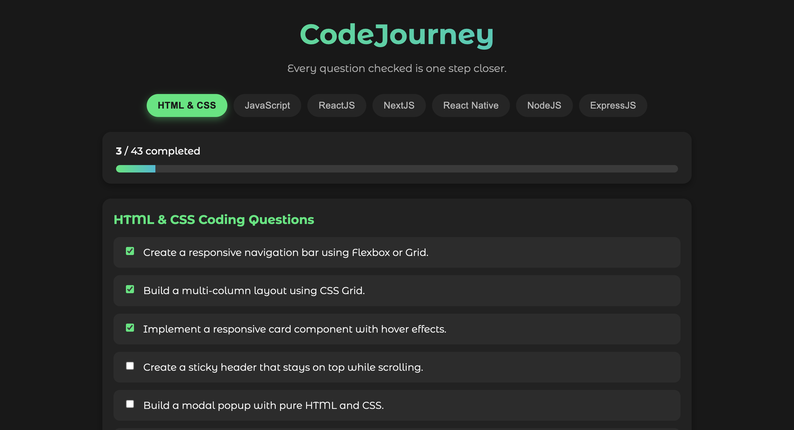

# CodeJourney

**CodeJourney** is a personal interview preparation tool designed for developers who want to track their progress while learning coding, React, Node.js, Next.js, and more. It's perfect for freshers and beginners preparing for interviews or coding practice.

I created **CodeJourney** for my own **interview preparation**, and it has really helped me stay organized and consistent.  
You can try this too to prepare for your interviews! 

**Try CodeJourney here:** [CodeJourney Live](https://code-journeyy.netlify.app/)

> The expert in anything was once a beginner.
**Virti Jain**  
- [GitHub](https://github.com/virtiijain)  
- [LinkedIn](www.linkedin.com/in/virtijain)
